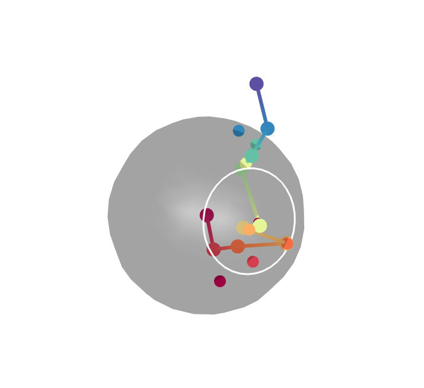
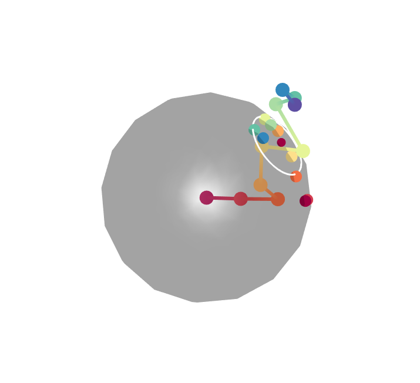

```{r setup, include = FALSE}
knitr::opts_chunk$set(
  collapse = TRUE,
  comment = "#>"
)
```
#SingleCellTrajectoryAnalysis

## Introduction

The TrajectoryGeometry package can be used to explore the directionality of pseudotime trajectories inferred from single cell data. In this vignette we explore trajectories which describe the development of mature enteric neurons and glial cells from bipotential progenitor cells. We focus on analysing two trajectories, one from bipotential projenitor to adult neuron ("Early" to "Adult_neurons"), and one from bipotential progenitor to adult glial cell ("Early" to "Glia_1"/"Glia2"). 

{width=50%}

Visually, the development of glial cells from bipotential progenitor cells appears to follow a fairly straight path with consistent directionality, whereas the development of neurons seems to, at first, follow the same trajectory and then branch off from this. We want to test the hypothesis that the glial trajectory demonstrates more consistent directionality than the neural trajectory.  

## Preparation

We load packages required for this vignette, set colours for plots, and set a random seed to ensure reproducability.
```{r}
#load packages
library(TrajectoryGeometry)
library(RColorBrewer)
library(dplyr)
library(ggplot2)

#set up colors
colors = colorRampPalette(brewer.pal(11,'Spectral')[-6])(100)

#set random seed
set.seed(42)
```


## The data

The data consists of a singleCellMatrix,   which contains PCA projections derived from normalised gene expression values for each cell. Any other features which describe the cells could also be used (i.e. normalised expression) values. The columns are the PCs and the rows are the cells. Rownames should be the names of the cells.  


There are also vectors of pseudotime values for both trajectories. These have been inferred using the SlingShot package. The vectors are named according to cell ID. N.B. where cells are not inferred to take part in a trajectory these are given an NA value. A number of projenitor cells are assigned to both trajectories in agreement with their "bipotential" nature. 


We will filter pseudotime trajectories and the singleCellMatrix to remove cells which do not take part in trajectories. Additionally, we will normalise pseudotime to range from 0 to 100 for each trajectory.

```{r}
#filter matrices
neuralAttributes = singleCellMatrix[!is.na(neuralPseudoTime),]
glialAttributes = singleCellMatrix[!is.na(glialPseudoTime),]

#filter pseudotime values
neuralPseudoTime = neuralPseudoTime[!is.na(neuralPseudoTime)]
glialPseudoTime = glialPseudoTime[!is.na(glialPseudoTime)]

#normalise pseudotime values to 100
neuralPseudoTimeNormalised = neuralPseudoTime  %>% {100*((. - min(.))/(max(.) - min(.)))}
glialPseudoTimeNormalised = glialPseudoTime %>% {100*((. - min(.))/(max(.) - min(.)))}
```


## Sampling a path

As many cells have been assigned to each trajectory, with unequal and uneven coverage of each trajectory, first we will sample a path through each trajectory. We will split the trajectory into 10 equal pseudotime windows and sample a single cell from each one. 

```{r}
neuralPath = samplePath(neuralAttributes, neuralPseudoTimeNormalised)
glialPath = samplePath(glialAttributes, glialPseudoTimeNormalised)
```


## Projecting path onto sphere and testing for directionality
We will test both sampled paths for directionality and obtain data regarding their spherical projections.

```{r}
neuralAnswerPermutation = testPathForDirectionality(neuralPath[,1:3],randomizationParams = c('byPermutation','permuteWithinColumns'),statistic = "mean", N = 1000)
glialAnswerPermutation = testPathForDirectionality(glialPath[,1:3],randomizationParams = c('byPermutation','permuteWithinColumns'),statistic = "mean", N = 1000)

neuralAnswerSteps = testPathForDirectionality(neuralPath[,1:3],randomizationParams = c('bySteps','preserveLengths'),statistic = "mean", N = 1000)
glialAnswerSteps = testPathForDirectionality(glialPath[,1:3],randomizationParams = c('bySteps','preserveLengths'),statistic = "mean", N = 1000)

cat(paste("Mean distance of projected neural pathway points from circle center:", neuralAnswerPermutation$sphericalData$distance))
cat(paste("\nMean distance of projected glial pathway points from circle center:", glialAnswerPermutation$sphericalData$distance))

cat("\n\nPermutation results")
cat(paste("\nP value for neural pathway:", neuralAnswerPermutation$pValue))
cat(paste("\nP value for glial pathway:", glialAnswerPermutation$pValue))

cat("\n\nRandomisation by step results")
cat(paste("\nP value for neural pathway:", neuralAnswerSteps$pValue))
cat(paste("\nP value for glial pathway:", glialAnswerSteps$pValue))
```

It is clear that the glial path shows significant directionality when compared to random paths obtained by permutation, and almost achieves significance when compared to paths created by taking random steps. In comparison the neural path does not show significant directionality in comparison to random paths. Additionally, projected points on the glial path the glial path show a smaller mean distance from the circle center than those for the neural path do. This suggests the glial path maintains a more consistent direction than the neural path.  

Let's visualise the paths and their projections.

The neural path:
```{r}
plotPathProjectionCenterAndCircle(path=neuralPath[,1:3],
                                  projection=neuralAnswerPermutation$sphericalData$projections,
                                  center=neuralAnswerPermutation$sphericalData$center,
                                  radius=neuralAnswerPermutation$sphericalData$distance,
                                  color=colors[cut(1:10,breaks=100)],
                                  circleColor = "white",
                                  pathPointSize = 20,
                                  projectionPointSize = 20,
                                  newFigure=TRUE)
```

Screenshot of the resulting figure:



The glial path:
```{r}
plotPathProjectionCenterAndCircle(path=glialPath[,1:3],
                                  projection=glialAnswerPermutation$sphericalData$projections,
                                  center=glialAnswerPermutation$sphericalData$center,
                                  radius=glialAnswerPermutation$sphericalData$distance,
                                  color=colors[cut(1:10,breaks=100)],
                                  circleColor = "white",
                                  pathPointSize = 20,
                                  projectionPointSize = 20,
                                  newFigure=TRUE)
```

Screenshot of the resulting figure:




## Sampling multiple paths

Here we have just analysed one possible path sampled from the trajectory. Let's analyse many. We will obtain 1000 sampled paths for each trajectory and obtain a random path parameterised on each of these (here we will permute each sampled path). This will allow us to compare the properties of 1000 sampled paths to the 1000 random paths. This can take a while so here we provide pre-analysed data. If you would like to run this please uncomment the code below. 

```{r}
# neuralAnswers = analyseSingleCellTrajectory(neuralAttributes, neuralPseudoTimeNormalised, nSamples = 1000, randomizationParams = c('byPermutation','permuteWithinColumns'), statistic = "mean", N = 1)
# #N.B N = 1 allows us to generate a single random path parameterised on each sampled path.
#  
# glialAnswers = analyseSingleCellTrajectory(glialAttributes, glialPseudoTimeNormalised, nSamples = 1000, randomizationParams = c('byPermutation','permuteWithinColumns'), statistic = "mean", N = 1)
```

Let's visualise the results and extract statistics. A paired Wilcox test is performed between sampled and random paths. Here a distance metric, which is indicative of how close the projected points are on the sphere, is used to compare paths. A lower distance indicates a more consistent directionality.
```{r}
neuralResultDistance = visualiseTrajectoryStats(neuralAnswers, "distance")
glialResultDistance = visualiseTrajectoryStats(glialAnswers, "distance")

#visualise plots
neuralResultDistance$plot
glialResultDistance$plot

cat(paste("Neural p value (comparison of distance metric):", neuralResultDistance$stats$p.value)) #should I make the wilcox test single tailed?

cat(paste("\nGlial p value (comparison of distance metric):", glialResultDistance$stats$p.value)) 
```

Although both neural and glial trajectories show significant directionality in terms of their distance metric in comparison to random paths, the glial pathway has a far lower p-value. 

We can also directly compare distances for the neural and glial pathways. Here statistics are calculated using unpaired Wilcox tests.
```{r}
distanceComparison = visualiseTrajectoryStats(neuralAnswers, "distance", traj2Data = glialAnswers)
# a violin plot is returned as distanceComparison$plot
# below we change x axis labels to indicate that the two trajectories being compared are neural and glial trajectories. 
distanceComparison$plot + scale_x_discrete(labels=c("Neural","Glial"))

cat(paste("Comparison of neural and glial trajectories (distance metric), p value:", distanceComparison$stats$p.value)) 
```

From this we can clearly see that the glial trajectory shows more consistent directionality than the neuronal trajectory.

It should be noted that in this vignette we have analysed the first 3 dimensions. However, an arbitrary number of dimensions can be analysed, only visualisation on the sphere is limited to 3 dimensions.

