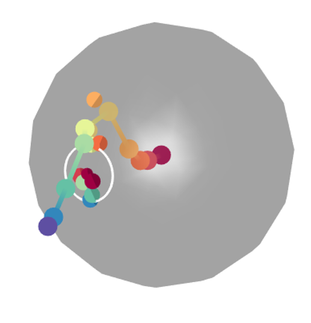

```{r setup, include = FALSE}
knitr::opts_chunk$set(
collapse = TRUE,
comment = "#>"
)
```
# SingleCellTrajectoryAnalysis

## Introduction

The TrajectoryGeometry package can be used to explore the directionality of
pseudotime trajectories inferred from single-cell data. In the liver
hepatoblasts give rise to hepatocytes and cholangiocytes. *Yang et al. (2017)*
have analysed single-cell data describing this process and state "the default
pathway for hepatoblasts is to differentiate into hepatocytes, but along the
way, some hepatoblasts are regulated to differentiate towards the cholangiocyte
fate".


```{r, echo=FALSE, out.width="50%", fig.cap="hepatoblast trajectory"}
knitr::include_graphics("trajectory.png")
```

Visually, the development of hepatocytes from hepatoblasts appears to follow a
fairly straight path with consistent directionality, whereas the development of
cholangiocytes seems to, at first, follow the same trajectory and then branch
off from this. We want to test the hypothesis that the hepatocyte trajectory
demonstrates more consistent directionality than the cholangiocyte trajectory.  


## Preparation

We load packages required for this vignette, set colours for plots, and set a
random seed to ensure reproducibility.
```{r}
#load packages
library(TrajectoryGeometry)
library(RColorBrewer)
library(dplyr)
library(ggplot2)

#set up colors
colors = colorRampPalette(brewer.pal(11,'Spectral')[-6])(100)

#set random seed
set.seed(42)
```


## The data

Single-cell data used in this vignette has been obtained from GEO (GSE90047) and
the script used for upstream processing is available at
https://github.com/AnnaLaddach/TrajectoryGeometryData

The data consists of a single_cell_matrix, which contains PCA projections
derived from normalised gene expression values for each cell. Any other features
which describe the cells could also be used (i.e. normalised expression)
values. The columns are the PCs and the rows are the cells. Row names should be
the cell IDs.  

There are also vectors of pseudotime values for both trajectories. These have
been inferred using the Slingshot package (*Street et al., 2018*). The vectors
are named according to cell ID. N.B. where cells are not inferred to take part
in a trajectory these are given an NA value. A number of progenitor cells are
assigned to both trajectories in agreement with their "bipotential" nature.

We will filter pseudotime trajectories and the `single_cell_matrix` to remove
cells which do not take part in trajectories. Additionally, we will normalise
pseudotime to range from 0 to 100 for each trajectory.

```{r}
#filter matrices
chol_attributes = single_cell_matrix[!is.na(chol_pseudo_time),]
hep_attributes = single_cell_matrix[!is.na(hep_pseudo_time),]
#filter pseudotime values
chol_pseudo_time = chol_pseudo_time[!is.na(chol_pseudo_time)]
hep_pseudo_time = hep_pseudo_time[!is.na(hep_pseudo_time)]

#normalise pseudotime values to range from 0 to 100
chol_pseudo_time_normalised =
    chol_pseudo_time  %>% {100*((. - min(.))/(max(.) -min(.)))}
hep_pseudo_time_normalised =
    hep_pseudo_time %>% {100*((. - min(.))/(max(.)- min(.)))}
```


## Sampling a path

First we will sample a path through each trajectory. We will split the
trajectory into 10 equal pseudotime windows and sample a single cell from each
one.

```{r}
cholPath = samplePath(chol_attributes, chol_pseudo_time_normalised)
hepPath = samplePath(hep_attributes, hep_pseudo_time_normalised)
```


## Projecting path onto sphere and testing for directionality
We will test both sampled paths for directionality and obtain data regarding
their spherical projections. Here we compare each sampled path to 100 random
paths. Generally it would be recommended to obtain a larger number of sampled
paths (e.g. 1000).

```{r}
cholAnswerPermutation = testPathForDirectionality(cholPath[,1:3],
    randomizationParams = c('byPermutation','permuteWithinColumns'),
    statistic = "mean",
    N = 100)

hepAnswerPermutation = testPathForDirectionality(hepPath[,1:3],
    randomizationParams = c('byPermutation','permuteWithinColumns'),
    statistic = "mean",
    N = 100)

cholAnswerSteps = testPathForDirectionality(cholPath[,1:3],
    randomizationParams = c('bySteps','preserveLengths'),
    statistic = "mean",
    N = 100)

hepAnswerSteps = testPathForDirectionality(hepPath[,1:3],
    randomizationParams = c('bySteps','preserveLengths'),
    statistic = "mean",
    N = 100)

cat(paste("Mean distance of projected cholangiocyte pathway points from circle
center:", cholAnswerPermutation$sphericalData$distance))
cat(paste("\nMean distance of projected hepatocyte pathway points from circle
    center:", hepAnswerPermutation$sphericalData$distance))

cat("\n\nPermutation results")
cat(paste("\nP value for cholangiocyte pathway:", cholAnswerPermutation$pValue))
cat(paste("\nP value for hepatocyte pathway:", hepAnswerPermutation$pValue))

cat("\n\nRandomisation by step results")
cat(paste("\nP value for cholangiocyte pathway:", cholAnswerSteps$pValue))
cat(paste("\nP value for hepatocyte pathway:", hepAnswerSteps$pValue))
```

It is clear that the sampled hepatocyte pathway has a lower distance metric
(mean distance of projected pathway points from circle center) than the
cholangiocyte pathway. Additionally, the sampled hepatocyte pathway shows
significant directionality in comparison to randomised pathways, both when these
are generated by permutation and by taking random steps. In comparison, the
sampled cholangiocyte pathway does not show significant directionality in
comparison to randomised pathways.

Let's visualise the paths and their projections.

The cholangiocyte path:
```{r}
plotPathProjectionCenterAndCircle(path=cholPath[,1:3],
    projection=cholAnswerPermutation$sphericalData$projections,
    center=cholAnswerPermutation$sphericalData$center,
    radius=cholAnswerPermutation$sphericalData$distance,
    color=colors[cut(1:10,breaks=100)],
    circleColor = "white",
    pathPointSize = 8,
    projectionPointSize = 8,
    newFigure=TRUE)
```

Screenshot of the resulting figure:


The hepatocyte path:
```{r}
plotPathProjectionCenterAndCircle(path=hepPath[,1:3],
    projection=hepAnswerPermutation$sphericalData$projections,
    center=hepAnswerPermutation$sphericalData$center,
    radius=hepAnswerPermutation$sphericalData$distance,
    color=colors[cut(1:10,breaks=100)],
    circleColor = "white",
    pathPointSize = 8,
    projectionPointSize = 8,
    newFigure=TRUE)
```

Screenshot of the resulting figure:




## Sampling multiple paths

Here we have just analysed one possible path sampled from the trajectory. Let's
analyse many. We will obtain 100 sampled paths for each trajectory and obtain a
random path parameterised on each of these (here we will permute each sampled
path). This will allow us to compare the properties of 100 sampled paths to the
100 random paths. Generally it would be recommended to obtain a larger number of
sampled paths (e.g. 1000).

```{r}
chol_answers = analyseSingleCellTrajectory(attributes = chol_attributes[,1:3],
    pseudotime = chol_pseudo_time_normalised,
    randomizationParams = c('byPermutation','permuteWithinColumns'),
    statistic = "mean",
    nSamples = 100,
    N = 1)
# #N.B N = 1 allows us to generate a single random path parameterised on each
# sampled path.

hep_answers = analyseSingleCellTrajectory(hep_attributes[,1:3],
    hep_pseudo_time_normalised,
    randomizationParams = c('byPermutation','permuteWithinColumns'),
    statistic = "mean",
    nSamples = 100,
    N = 1)
```

Let's visualise the results and extract statistics. A paired Wilcox test is
performed between sampled and random paths. Here a distance metric, which is
indicative of how close the projected points are on the sphere, is used to
compare paths. A lower distance indicates a more consistent directionality.

```{r}
cholResultDistance = visualiseTrajectoryStats(chol_answers, "distance")
hepResultDistance = visualiseTrajectoryStats(hep_answers, "distance")

#visualise plots
cholResultDistance$plot
hepResultDistance$plot

cat(paste("Cholangiocyte p value (comparison of distance metric):",
    cholResultDistance$stats$p.value))

cat(paste("\nHepatocyte p value (comparison of distance metric):",
    hepResultDistance$stats$p.value))
```

Although both cholangiocyte and hepatocyte trajectories show significant
directionality in terms of their distance metric in comparison to random paths,
the hepatocyte trajectory has a far lower p-value.

We can also directly compare distances for the cholangiocyte and hepatocyte
pathways. Here statistics are calculated using unpaired Wilcox tests.
```{r}
distanceComparison = visualiseTrajectoryStats(chol_answers, "distance",
    traj2Data = hep_answers)
# a violin plot is returned as distanceComparison$plot
# below we change x axis labels to indicate that the two trajectories being
# compared are neural and glial trajectories.

distanceComparison$plot +
    scale_x_discrete(labels=c("Cholangiocyte","Hepatocyte"))

cat(paste("Comparison of cholangiocyte and hepatocyte trajectories
    (distance metric), p value:", distanceComparison$stats$p.value))
```

From this, we can clearly see that the hepatocyte trajectory shows more
consistent directionality than the cholangiocyte trajectory.

## Branch point analysis

We can hypothesise that the cholangiocyte trajectory will maintain a more
consistent directionality from the branch point onwards.
First let's try to identify the approximate pseudotime value of the branch
point. We can do this by calculating the minimum distances between the two
trajectories for each point along the cholangiocyte trajectory. The distances
between the two trajectories should be very small before the branch point and
increase as the trajectories diverge after the branch point.

```{r}
distances = distanceBetweenTrajectories(chol_attributes, chol_pseudo_time,
    hep_attributes)

plot(distances$pseudotime, distances$distance,
    xlab = "cholangiocyte pseudotime", ylab = "minimum distance")
```


It seems clear that the cholangiocyte trajectory has branched off by
pseudotime 40.

Let's analyse the trajectory geometry starting from successive points from 0 to
50. In the interest of time, we will only sample 100 paths for each point in
pseudotime. Generally, it would be recommended to sample a larger number of
paths (e.g. 1000).

```{r}
chol_branch_point_results = analyseBranchPoint(chol_attributes[,1:3],
                                        chol_pseudo_time,
                                        randomizationParams = c("byPermutation",
                                                        "permuteWithinColumns"),
                                        statistic = "mean",
                                        start = 0,
                                        stop = 50,
                                        step = 5,
                                        nSamples = 100,
                                        N = 1)
```

Let's extract statistics and visualise the results.
```{r}
cholBranchPointStats = visualiseBranchPointStats(chol_branch_point_results)
print(cholBranchPointStats$distancePlot)
print(cholBranchPointStats$pValuePlot)
```

We can clearly see that the mean distance decreases as we approach the branch
point, whereas the -log10(p-value), despite some fluctuation, increases as we
approach the branch point. This suggests that the cholangiocyte trajectory
maintains more consistent directionality after the branch point.

Let's investigate whether the same thing happens to the hepatocyte trajectory.
First, let's estimate where the hepatocyte branch point is.

```{r}
distances = distanceBetweenTrajectories(hep_attributes, hep_pseudo_time,
                            chol_attributes)

plot(distances$pseudotime, distances$distance, xlab = "hepatocyte pseudotime",
    ylab = "minimum distance")
```

It looks like the hepatocyte trajectory branches off around pseudotime 20.

Again we analyse the trajectory geometry starting from successively later
points.
```{r}
hepBranchPointResults = analyseBranchPoint(hep_attributes[,1:3],
    hep_pseudo_time,
    randomizationParams = c("byPermutation",
    "permuteWithinColumns"),
    statistic = "mean",
    start = 0,
    stop = 50,
    step = 5,
    nSamples = 100,
    N = 1)
```
Let's extract statistics and visualise results.

```{r}
hepBranchPointStats = visualiseBranchPointStats(hepBranchPointResults)
print(hepBranchPointStats$distancePlot)
print(hepBranchPointStats$pValuePlot)
```

We see no consistent decrease as we approach the branch point, in fact, the mean
distance appears to increase as we approach the branch point. A decrease is seen
in the mean distance after the branch point, this could potentially be
attributed to increased noise around the branch point.

It should be noted that in this vignette we have analysed the first 3
dimensions. However, an arbitrary number of dimensions can be analysed, only
visualisation on the sphere is limited to 3 dimensions.

## References

Street K, Risso D, Fletcher RB, et al. Slingshot: cell lineage and pseudotime
inference for single-cell transcriptomics. BMC Genomics. 2018;19(1):477.
Published 2018 Jun 19. doi:10.1186/s12864-018-4772-0

Yang L, Wang WH, Qiu WL, Guo Z, Bi E, Xu CR. A single-cell transcriptomic
analysis reveals precise pathways and regulatory mechanisms underlying
hepatoblast differentiation. Hepatology. 2017;66(5):1387-1401.
doi:10.1002/hep.29353
