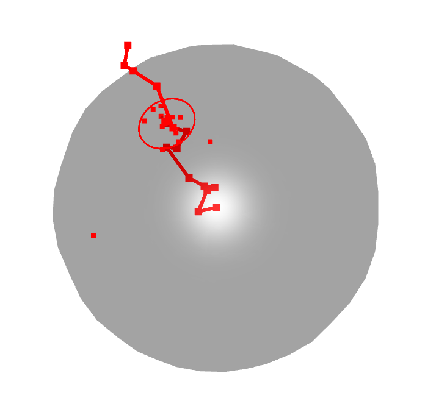

```{r setup, include = FALSE}
knitr::opts_chunk$set(
    collapse = TRUE,
    comment = "#>"
)
```
# TrajectoryGeometry

## Introduction

The purpose of this package is to discover directionality in the
changes in a time or pseudo-time series of gene expression.  

A direction in N-dimensional space is a point on the (N-1)-sphere.
That is, a direction in 2-dimensional space is a point on the circle
(i.e., the circumference of the circle), a direction in 3-dimensional
space is a point on the sphere (i.e., the surface of a solid ball),
and so on in higher dimensions. A direction in 25000-dimensional gene
expression space is a point on the 24999-dimensional sphere in this
space.

If we have a trajectory in some space, we can look out from the
starting point and follow the direction of that trajectory on the
sphere as seen from our vantage point.  This will give us a collection
of points on the sphere.  If that trajectory is moving in some
well-defined direction, those points on the sphere should be close
together.  We'll say more in a moment as to how to determine whether
these points are close.

We illustrate here a path in 3-dimensional space, the projection of
its points onto the 2-sphere and the center of a circle which
minimizes mean distance to these points and the circle representing
this mean distance.  We can see that some of the early steps produce
outliers on the sphere.


```{r, echo=FALSE, out.width="50%",
    fig.cap="A path and its projection to the sphere."}

```

This approach is very general.  Given gene expression data organized
in a time series we can apply these methods to the gene expression, to
normalized gene expression or to any chosen dimension of a principal
component analysis of the data set.

## The Algorithm

### A Path gives points on a sphere

Suppose we have a matrix $latex X$ with $latex N$ rows and $latex D$
columns. Here we consider each row as a time point and each each
column as a feature which could be expression or normalized expression
of a given gene or a principal component.  We therefore have a
path consisting of $latex N$ points in $latex D$ dimensional space.
In our experience, biological trajectories are capable of changing
direction, so we may wish to query the data for directionality
starting at the $latex k$th time point.  Let $latex x_i$ be the $latex
i$th row of $latex X$.  We will consider the matrix $latex X'$
starting with the $latex k$th row of $latex X$. We view the successive
points from $latex x_k$ and consider the successive vectors $latex
y_1=x_{k+1} - x_k$, $latex y_2=x_{k+2} - x_k$, ..., $latex y_m=x_{N} -
x_k$.  (Thus $latex m = N - k - 1$.)  Taking $$latex p_i = { y_i \over
|| y_i ||}$$ gives $latex m$ points on the unit sphere which represent
the directionality of the path $latex x_k, \dots, x_N$.

### How close are these points on the sphere?

We would like to measure how compactly a set of points $latex
p_1,\dots,p_m$ sit on the sphere.  To to this we would like to find a
center for these points and a circle (more generally as $latex N-2$
dimensional sphere) which measures their collective
separation from that center.  The measure of their collective distance
from their center could be their median, their mean or their maximum
distance from this center.  The center is chosen to minimize whichever
summary statistic we're using.  Distance in this context is spherical
distance, i.e., the angular distance between points as viewed from the
center of the sphere.  That is, we take $latex \mu$ to be one of the
functions median, mean or max.  The center is then
$$latex C = {\mathrm{argmin}}_x
\mu(d(x,p_1),d(x,p_2),\dots,d(x,p_m))$$
and
$$latex R_\mu = \mu(d(x,p_1),d(x,p_2),\dots,d(x,p_m))$$
In this way, we get a map
$$latex X' \mapsto R_\mu $$
and we take $latex R_\mu$ as our measure of the clustering of the
points $latex p_i$ and therefore of the directionality of $latex X'$.

### Testing for statistical significance

We would like to test whether this clustering is statistically
significant.  To ask whether the points $latex p_i$ are close is to
ask, close compared to what?  We do this by producing $K$ randomized paths
$latex Y_1, \dots, Y_K$ modeled on $latex X'$.  For each of these we
compute $latex R_{\mu,i}$.  A p-value for the directionality of $latex
X'$ comes from the ranking of $latex R_\mu$ among $latex R_{\mu,1},
\dots, R_{\mu,K}$.  If it is less than all but 5% of these, you have
detected a p-value of p<0.05.

### Randomization

This package offers several methods for producing a set of randomized
paths based on a path $latex X$.  They are roughly divided into two
methods.  One produces a random path by taking random steps in the
ambient space of $latex X$  and one produces random paths by permuting
the entries in $latex X$.

* Random steps.  Here we produce a path starting at the same point as
$latex X$ and having the same number steps.  
* There is an option to require the steps to have the same length as
those of $latex X$.  This is done by including 'preserveLengths' in
the randomization parameter.  If this is omitted all steps will have
length 1.
```{r message=FALSE}
library(TrajectoryGeometry)
randomizationParams = c('bySteps','preserveLengths')
Y = generateRandomPaths(path=straight_path,
                        randomizationParams=randomizationParams,
                        N=10)
```
* Negative values in the randomized paths may be reasonable in the
case where one is working with PCA data and can expect negative
values. However, in the case of non-negative gene expression data,
the randomized paths should also be non-negative and this can be
accomplished by including the value 'nonNegative'
```{r message=FALSE}
randomizationParams = c('bySteps','preserveLengths','nonNegative')
Y = generateRandomPaths(path=straight_path,
                        randomizationParams=randomizationParams,
                        N=10)
```
* Permutation.  Here we produce the randomized paths by permuting the
entries of $latex X$.  This can be done either by permuting the
entries of $latex X$ freely or permuting values within each column
spearately.  The former may be appropriate in the case of PCA data
or in the case of normalized gene expression data where the
expression levels are fairly uniform between genes.  However, in the
case where different genes have significantly different expression
levels, it seems appropriate to restrict to permutations which
preserve columns.  These operations are carried out as above using
either of the following:
*
```{r message=FALSE}
randomizationParams = c('byPermutation','permuteAsMatrix')
randomizationParams = c('byPermutation','permuteWithinColumns')
```

## Does a path confined to a direction consistently move in that direction?

The answer here is not necessarily.  Consider a path which starts out
at the origin and the heads out along the x-axis.  Perhaps is gets a
little ways out and then takes to wandering back and forth.  As long
as it never quite gets back to the origin, the methods we have
described will show this path as highly directional.  Accordingly if
you have determined that your path has strong directionality using
these methods, it is appropriate to check for progression in that
direction. This can be done with the function pathProgression()
```{r message=FALSE}
progress = pathProgression(straight_path,direction=straight_path_center)
progress = pathProgression(crooked_path,from=6,direction=crooked_path_center)
```
## Stability

A related issue which can also be checked using pathProgression() is
the instability of behavior in the neighborhood of the starting point
of a path.  Consider a path which starts at a point $latex P_0$ and
after oscillating small distances in the neighborhood of $latex P_0$
proceeds in a highly directional manner towards a point $latex P_k$.
We would like to see this as a highly directional path.  However, the
oscillations around $latex P_0$, no matter how small, can in
projection occupy large portions of the sphere.  Accordingly
testPathForDirectionality() may be bamboozled out of detecting
directionality.  A prophylaxis against this is the following:
```{r message=FALSE}
direction = oscillation[nrow(straight_path),] - oscillation[1,]
progress = pathProgression(oscillation,direction=direction)
```
This will allow you to detect a portion of the path which does not
depart from the neighborhood of its starting point. You can then use
the from parameter of testPathForDirectionality() to eliminate these
oscillations from consideration.  Note that we did not need to
normalize direction as that is done within pathProgression().
